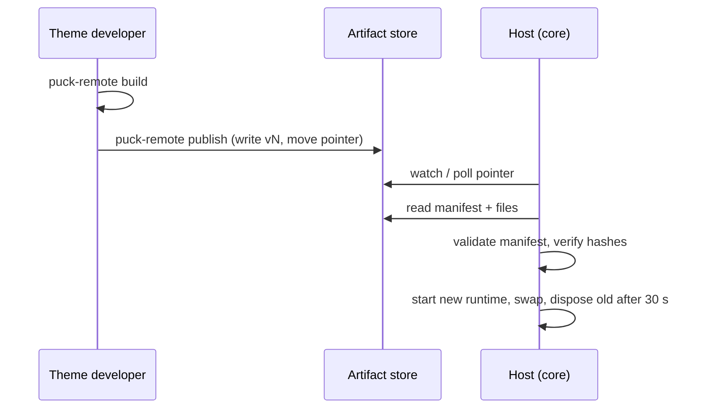

An **artifact** is one immutable, published version of a theme:

```files
artifacts
├── current.json
├── v1
│   ├── manifest.json
│   ├── bundle.js
│   └── assets
│       └── theme.css
└── v2
    ├── manifest.json
    ├── bundle.js
    └── assets
        └── theme.css
```

| File | Content |
|---|---|
| `manifest.json` | Blocks, root, fields, queries, adapters, categories, and the sha256 of every file |
| `bundle.js` | One script: isolate shims, React, `react-dom/server`, the SDK runtime and the theme code |
| `assets/**` | CSS, client scripts, images |
| `current.json` | `{"version": N}`: the active version |

## Lifecycle



1. `puck-remote build` produces `dist/` on the developer's machine ([build pipeline](/docs/internal/architecture/build-pipeline)).
2. `puck-remote publish` writes the next version number through an `ArtifactStore` (never reusing
   a number, even after a rollback) and moves the pointer.
3. The host notices the pointer change (store `watch`, or polling every `artifactPollMs`, default
   2000 ms, [D-0065](/docs/internal/decisions#D-0065)).
4. The [artifact loader](/docs/internal/architecture/artifact-loader) validates the manifest with zod,
   recomputes derived data, verifies every file hash, creates a new render runtime, swaps it in,
   and disposes the previous one after a 30 s grace period.
5. **Any failure keeps the last good version serving.**

Rollback is just `puck-remote activate <N>`.

## Why the host re-validates everything

The CLI runs on an untrusted machine. The host therefore has its **own** manifest schema
(`manifest-schema.ts`): closed field types, the `visibleIf` grammar and the query language. It
recomputes `propRefs` and `usesRequestParams` instead of trusting the values the CLI wrote.

`sdkMajor` versions the wire contract between the SDK and the host. The host only accepts
`sdkMajor: 1` and rejects older artifacts with an explicit message.

## Storage

Artifacts live behind the `ArtifactStore` contract ([D-0058](/docs/internal/decisions#D-0058)). The default
`@puck-remote/artifacts-fs` suits a single server; serverless and multi-instance deployments need
a shared store (S3-style). See [Core › Adapters](/docs/core/adapters).

## Serving assets

`/theme/v<N>/assets/**` serves a file only if it is listed in that version's manifest **and** its
hash still matches, with `immutable` caching and `nosniff`. The bundle itself is never served
([D-0080](/docs/internal/decisions#D-0080)).

Deep dive: [artifact loader](/docs/internal/architecture/artifact-loader).
