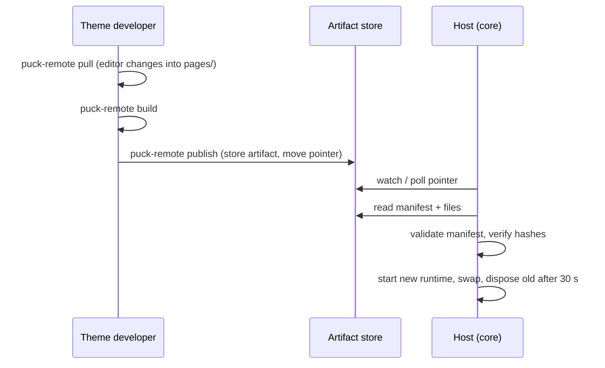

An **artifact** is one immutable, published state of a theme: its code **and its pages**, like a
Shopify theme carries its sections and its `templates/*.json` together
([D-0188](/docs/internal/decisions#D-0188)). Because a page always ships with the code it was made for,
there are no content migrations: changing a block's fields and the pages that use it is one
change, published at once.

```files
artifacts
├── current.json
├── 1d361ac2d6ec…
│   ├── manifest.json
│   ├── bundle.js
│   ├── bundle.browser.js
│   ├── bundle.islands.js
│   ├── assets
│   │   └── theme.css
│   └── pages
│       ├── home.json
│       └── search.json
└── e1cf82a1deba…
```

| File | Content |
|---|---|
| `manifest.json` | Blocks, root, fields, queries, adapters, categories, and the sha256 of every other file (pages included) |
| `bundle.js` | The theme for the server sandbox: isolate shims, React, `react-dom/server`, the SDK runtime and the theme code |
| `bundle.browser.js` | The theme for the editor: ESM, React and the SDK left to the editor |
| `bundle.islands.js` | Only the theme's `"use client"` modules, hydrated on public pages ([interactive components](/docs/guides/interactive-components)); absent without islands |
| `assets/**` | CSS, client scripts, images |
| `pages/<slug>.json` | Puck page data |
| `current.json` | The current artifact's id |

## Ids

An artifact id is an **opaque string chosen by the store** ([D-0189](/docs/internal/decisions#D-0189)):
the core never computes or interprets it, it only requires `[A-Za-z0-9._-]{1,128}` because ids
appear in URLs. `@puck-remote/artifacts-fs` uses a content hash, like a git commit: the same
files always give the same id, and storing them twice keeps one copy
([D-0206](/docs/internal/decisions#D-0206)). Another store may use counters or database keys.

## Lifecycle



1. `puck-remote build` produces `dist/` (code and pages) on the developer's machine
   ([build pipeline](/docs/internal/architecture/build-pipeline)). A page using a block the theme
   doesn't have fails the build.
2. `puck-remote publish` stores it through an `ArtifactStore` and moves the pointer.
3. The host notices the pointer change (store `watch`, or polling every `artifactPollMs`, default
   2000 ms, [D-0065](/docs/internal/decisions#D-0065)).
4. The [artifact loader](/docs/internal/architecture/artifact-loader) validates the manifest with zod,
   recomputes derived data, verifies every file hash, creates a new render runtime, swaps it in,
   and disposes the previous one after a 30 s grace period.
5. **Any failure keeps the last good artifact serving.**

Saving a page from the editor also creates an artifact: the same files with the new page
(see [Pages and publishing](/docs/guides/publishing)). Rollback is just
`puck-remote activate <id>`.

## Why the host re-validates everything

The CLI runs on an untrusted machine. The host therefore has its **own** manifest schema
(`manifest-schema.ts`): closed field types, the `visibleIf` grammar and the query language. It
recomputes `propRefs` and `usesRequestParams` instead of trusting the values the CLI wrote.

`sdkMajor` versions the wire contract between the SDK and the host. The host only accepts
`sdkMajor: 3` and rejects older artifacts with an explicit message.

## Storage

Artifacts live behind the `ArtifactStore` contract ([D-0197](/docs/internal/decisions#D-0197)). The default
`@puck-remote/artifacts-fs` suits a single server; serverless and multi-instance deployments need
a shared store (S3-style). See [Core › Adapters](/docs/core/adapters).

## Serving files

`/theme/<id>/assets/**`, `/theme/<id>/bundle.browser.js` and `/theme/<id>/bundle.islands.js` are served only if listed in that
artifact's manifest **and** their hash still matches, with `immutable` caching and `nosniff`.
`bundle.js`, the manifest and pages are never served. When the editor is configured, these
responses allow the editor origin (CORS), which loads the browser bundle
([D-0200](/docs/internal/decisions#D-0200)).

Deep dive: [artifact loader](/docs/internal/architecture/artifact-loader).
