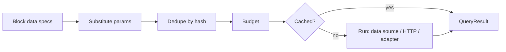

Blocks never fetch. Each block declares a `data` object of **query specs**, built with the SDK
builders, which only produce JSON:

| Builder | Target |
|---|---|
| `find(collection, { where, limit, sort, select, depth, page })` | Host `DataSource` |
| `findByID(collection, id, { select, depth })` | Host `DataSource` |
| `global(slug)` | Host `DataSource` |
| `query(adapter, op, params)` | A theme adapter (sans-IO translator) + host HTTP |
| `http({ origin, path, method, params, headers })` | A JSON endpoint, via host HTTP |

## Parameter references

Values inside a spec may be references the host substitutes per instance:

| Ref | Value |
|---|---|
| `{ $prop: 'name' }` | The block prop (JSON scalars only; objects become `null`) |
| `{ $page: 'slug' \| 'locale' }` | Current page |
| `{ $site: 'locale' \| 'name' }` | Site config |
| `{ $query: 'q' }` | URL search param (max 256 chars). **Makes the page uncacheable.** |
| `{ $secret: 'NAME' }` | Header value only; substituted by the host for bound origins |

## Why declarative

- **Security**: the host decides what can be reached and how ([host source](/docs/internal/architecture/host-source), [HTTP source](/docs/internal/architecture/http-source)); secrets never enter the isolate.
- **Performance**: the host sees every query of the page at once, so it **dedupes** identical
  queries, applies a **budget**, runs them **in parallel**, and **caches** results.
- **Cacheability**: the host knows statically which pages read request params.
- **Draft safety**: `mode` (`public`/`draft`) is set by the host only; drafts are never cached.

## Budget (defaults)

| Limit | Value | Config key |
|---|---|---|
| Unique queries per page | 20 | `budget.maxQueries` |
| Total response bytes | 2 MB | `budget.maxResponseBytes` |
| Page wall time | 3000 ms | `budget.maxWallMs` |

Queries beyond the budget, in tree order, degrade to `{ ok: false, error: 'budget' }`.

## Error codes

`budget`, `blocked`, `forbidden`, `timeout`, `secret`, `adapter`, `http-status`, `too-large`,
`invalid-json`, `network`, `unknown-adapter`, `invalid-where`, `invalid-select`, `invalid-sort`,
`unavailable`, and `loading` (editor only, before data arrives).

Deep dive: [query resolver](/docs/internal/architecture/query-resolver). Reference: [query spec](/docs/sdk/query-spec).
