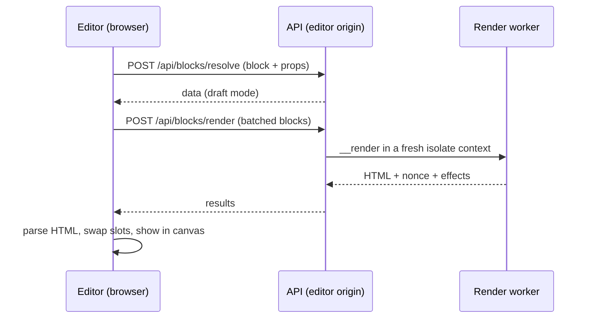

The editor is a standard Puck editor (`@puckeditor/core` 0.23) whose config is **built from the
manifest's JSON only**:

- fields are mapped from field specs (`editor/fields.ts`), including host-owned fields
  `host:color`, `host:media`, `host:link`;
- `visibleIf` becomes a Puck `resolveFields`;
- blocks with data get a `resolveData` that calls `POST <api>/blocks/resolve` (draft mode);
- each block's `render` asks the **server** for HTML via `POST <api>/blocks/render`.

## Why server rendering

Before M2, the editor loaded `bundle.js` into a hidden same-origin iframe
([D-0015](/docs/internal/decisions#D-0015), [D-0023](/docs/internal/decisions#D-0023)). That meant theme JavaScript in the
admin origin: equivalent to XSS with an admin session. M2 replaced it
([D-0080](/docs/internal/decisions#D-0080)):

- the canvas renders through the same isolate pipeline as the public site, so **parity is
  automatic**;
- **no theme JavaScript ever runs in the editor's origin**; the bundle is never served;
- the cost: theme client scripts don't run in the canvas.

## Data in the editor

`resolveData` writes results into the reserved prop `__data`, marked `readOnly`. It re-runs only
when a prop referenced by `$prop` changed (from the manifest's `propRefs`), on load/insert, or on
force, and keystrokes are debounced. **On save, `__data` is stripped** from every node, because
Puck would otherwise persist it ([D-0028](/docs/internal/decisions#D-0028); test 18).

## Saving and publishing

The editor opens the page's latest **draft**. **Save draft** stores a new revision without touching
the public site; **Publish** makes a revision public. Saves are refused if someone else saved in
the meantime. See [Drafts and publishing](/docs/guides/publishing).

## Rendering pipeline in the browser

`createRemoteRenderer` batches every render request issued in the same tick into one POST (one
isolate session server-side), caches results by input (LRU 500), and `useRemoteRender` keeps the
previous HTML while a newer render is in flight (150 ms debounce).

Deep dive: [editor lifecycle](/docs/internal/architecture/editor-lifecycle).
