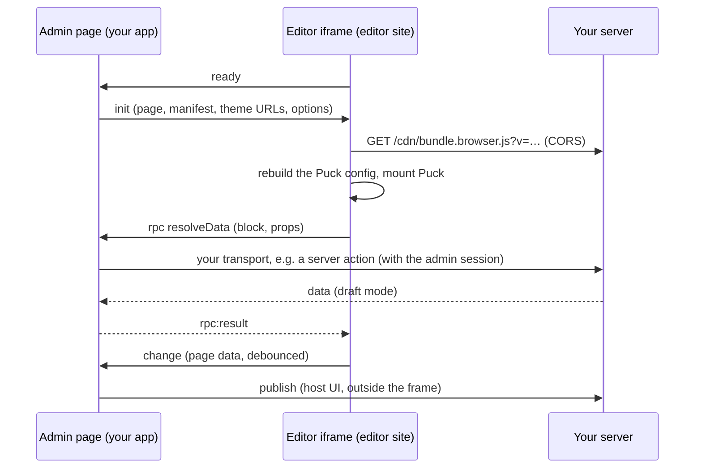

The editor is a **React page on its own site** (for example `https://editor.example.net`) that
runs the full Puck editor: native canvas drag and drop, real theme components
([D-0192](/docs/internal/decisions#D-0192)). You render it with `<PuckRemoteEditor>` and can customize it
like any Puck editor ([D-0228](/docs/internal/decisions#D-0228)). It holds **no credentials**: it never authenticates, never
calls your backend and never sees a secret. All authority stays in your app.

## Two sides

- **Your admin page** renders `<PuckEditorFrame>` from `@puck-remote/editor/frame` with the
  payload from `core.editorPayload(slug)`, a map of allow-listed RPC handlers and an `onChange`
  callback ([D-0209](/docs/internal/decisions#D-0209)). Publishing is a button in **your** UI, outside the
  frame, so theme code running in the editor can never publish.
- **Your editor page** renders `<PuckRemoteEditor>` from `@puck-remote/editor/react`, on the
  editor origin. It waits for `init`, imports the theme's `bundle.browser.js` (handing it your
  app's React through globals), rebuilds the Puck config from the manifest (fields,
  defaults, categories) plus the bundle's render functions, and mounts Puck. Functions never cross
  `postMessage`; only JSON does.

Both sides check where they run ([D-0207](/docs/internal/decisions#D-0207)): the frame refuses to load
outside a host (admin) origin, `<PuckRemoteEditor>` refuses an `init` unless it runs on the configured editor
origin and the message comes from an admin origin. Every message is validated against the typed
protocol (version, shape, size, rate). See [Editor protocol](/docs/internal/architecture/editor-protocol).
Your editor code can call your admin page too: `useEditor().rpc(method, params)` reaches the
methods listed in the frame's `rpc` map.

## Data in the editor

Blocks with data get a Puck `resolveData` that asks the host through the `resolveData` RPC; your
handler calls `core.resolveBlockData(slug, block, props)` (draft mode). Only the block name and
its props go over the wire; the query always comes from the manifest, and the page slug from your
admin page's state, never from the editor ([D-0202](/docs/internal/decisions#D-0202)). Results land in
the reserved prop `__data`, marked `readOnly`, and are stripped when a page is written
([D-0028](/docs/internal/decisions#D-0028)).

## Why the editor runs theme code now

Before, the canvas was rendered on the server so that no theme JavaScript ran next to an
editor's session ([D-0080](/docs/internal/decisions#D-0080), superseded). Running the editor on a separate,
credential-free site gives the same protection while letting blocks be real client components in
the canvas. The browser enforces the boundary: the editor's site has no cookies for your app, and
`frame-ancestors` only lets your admin origins embed it.

Set-up: [Customizing the editor](/docs/guides/editor-app). Deep dive: [editor lifecycle](/docs/internal/architecture/editor-lifecycle).
