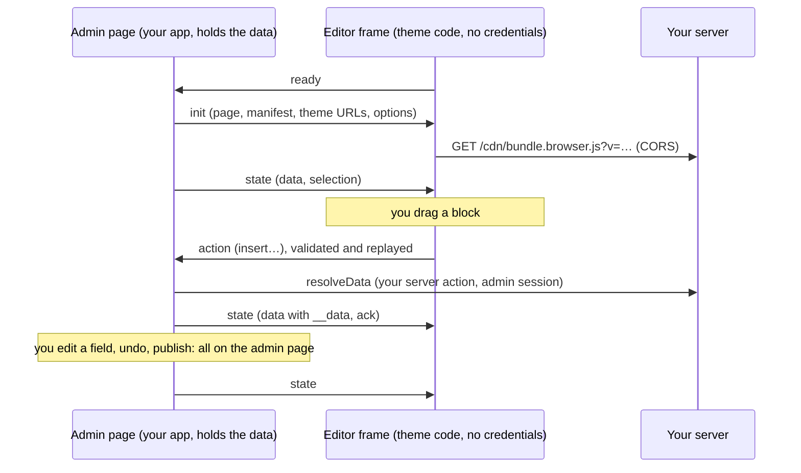

Puck is split in two ([D-0325](/docs/internal/decisions#D-0325)):

- **Your admin page** (`https://admin.example.com`) runs a Puck built from the manifest alone:
  fields, defaults, categories, `visibleIf`. It shows Puck's native layout (header, plugin rail,
  outline, fields) and holds the **page data and the history**. Your header actions, Publish and
  plugins live there. **No theme code runs there.**
- **The editor frame** (another site, e.g. `https://editor.example.net`), in the center of that
  layout, runs Puck with the theme's real components: the **canvas** and the **drawer** you drag
  blocks from, plus any plugin panel marked to render in the frame. It holds **no credentials**:
  it never authenticates, never calls your backend and never sees a secret.

The frame doesn't edit the page itself: it **proposes Puck actions** (insert, move, edit, select…).
Your admin page validates them, replays them on its own Puck, and sends its state back. Theme code
in the frame can therefore never publish, reach version history or call anything you haven't
listed, because none of it exists there.

## Two sides

- **Admin page:** `<PuckEditorFrame>` from `@puck-remote/editor/frame`, with the payload from
  `core.editorPayload(name, { params })` and your `resolveData` ([D-0327](/docs/internal/decisions#D-0327)). It
  renders a real `<Puck>`, so your layout uses Puck's own components (`<Puck.Fields />`) and hooks
  (history, data), plus `<PuckEditorFrame.Canvas />` for the frame.
- **Editor page:** `<PuckRemoteEditor>` from `@puck-remote/editor/react`, on the editor origin. It
  waits for `init`, imports the theme's `bundle.browser.js` (handing it your app's React through
  globals), builds the Puck config with the theme's components, and shows Puck's UI without its
  header or fields panel. Functions never cross `postMessage`; only JSON does.

Both sides check where they run ([D-0207](/docs/internal/decisions#D-0207)). The frame refuses to
load outside a host (admin) origin, and `<PuckRemoteEditor>` refuses an `init` unless it runs on
the configured editor origin and the message comes from an admin origin. Every message is
validated against the typed protocol (version, shape, size). See
[Editor protocol](/docs/internal/architecture/editor-protocol).

## Data in the editor

Blocks with data get a Puck `resolveData` **on the admin page**, which calls your `resolveData`
prop, typically a server action calling `core.resolveBlockData(name, block, props, { params })` in draft
mode. Only the block name, its props and the template's params are sent; the query always comes from the manifest
([D-0202](/docs/internal/decisions#D-0202)). Results land in the reserved prop `__data`, marked
`readOnly`, travel to the frame with the state, and are stripped when a template is written
([D-0028](/docs/internal/decisions#D-0028)).

## Why the frame runs theme code

Blocks are real client components in the canvas. Running them on a separate, credential-free site
keeps them away from your admin session: the browser enforces it, since the editor's site has no
cookies for your app and `frame-ancestors` only lets your admin origins embed it. Since the split,
the frame also holds no authority of its own: everything it does goes through validated actions
that your admin page applies.

Set-up: [Customizing the editor](/docs/guides/editor-app). Deep dive: [editor lifecycle](/docs/internal/architecture/editor-lifecycle).
