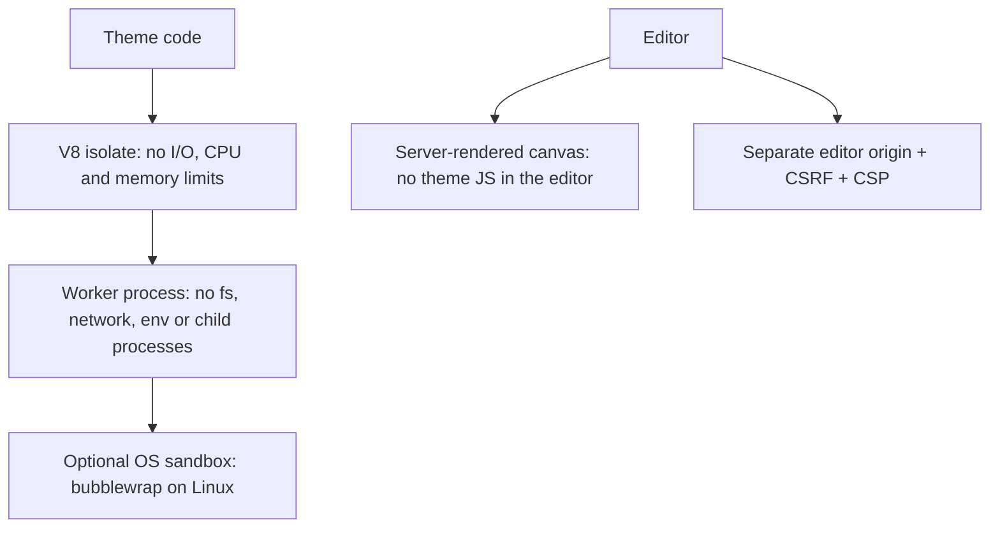

puck-remote assumes **theme authors are untrusted**: a theme may come from a marketplace and may be
actively hostile. Everything else follows from that.

| Actor | Trusted? | Where its code runs |
|---|---|---|
| Theme code (`render`, adapter translators) | **No** | A V8 isolate inside a permission-restricted worker process |
| Theme metadata (fields, defaults, queries) | **No**, validated as data | Read from the manifest, re-validated by the host |
| Theme client scripts | **No** | Visitors' browsers, on the **site** origin only |
| Your adapters (data, pages, artifacts, cache, auth) | Yes | Your server |
| Editors | Authenticated, authorized per action | Their browser, on the **editor** origin |

## What a hostile theme cannot do

- run code on your server outside the sandbox, or do any I/O;
- read collections or fields you did not expose, or see drafts;
- read your secrets or reach private network addresses;
- hang or crash your server;
- run JavaScript in the editor, or use an editor's session from the public site;
- forge slots to inject content into other blocks.

## What you must do

- Configure `auth` and distinct `origins` for production (the app refuses to start otherwise).
- Keep auth cookies host-only on the editor domain.
- Expose only the collections and fields themes need in your data source.
- Follow [Deploying safely](/docs/guides/deploying).

The full layer-by-layer analysis is in the
[threat model](/docs/internal/architecture/threat-model).
