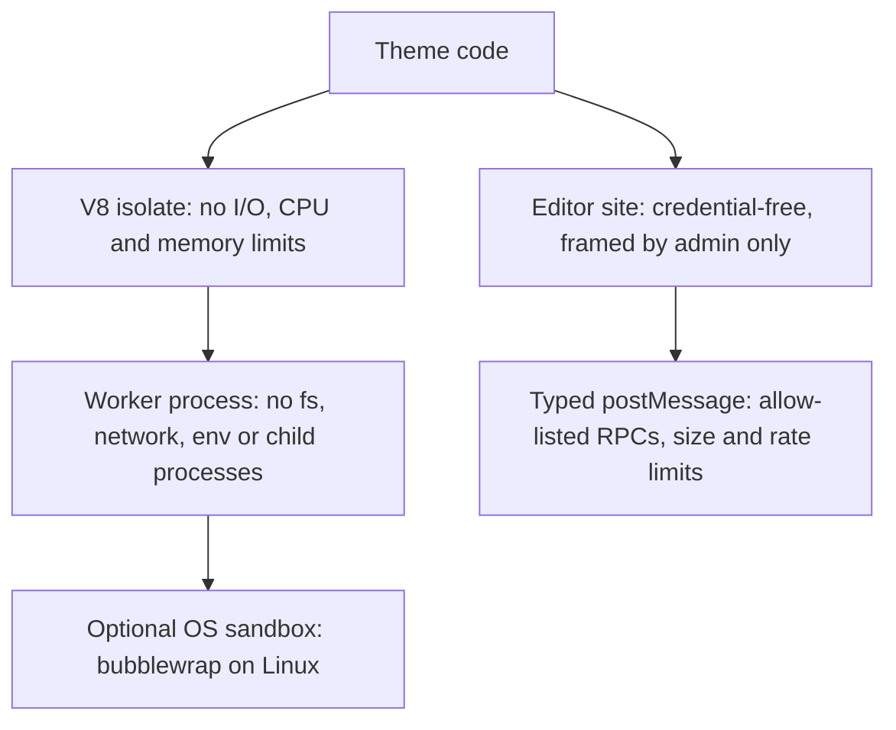

puck-remote assumes **theme authors are untrusted**: a theme may come from a marketplace and may be
actively hostile. Everything else follows from that.

| Actor | Trusted? | Where its code runs |
|---|---|---|
| Theme code on the server (`render`, adapter translators) | **No** | A V8 isolate inside a permission-restricted worker process |
| Theme code in the editor | **No** | The editor's site: no cookies, no secrets, only allow-listed RPCs |
| Theme metadata and pages | **No**, validated as data | Read from the artifact, re-validated by the host |
| Theme client scripts | **No** | Visitors' browsers, on the public site |
| Your plugins (data source, artifact store) and admin pages | Yes | Your server and admin origin |

## What a hostile theme cannot do

- run code on your server outside the sandbox, or do any I/O;
- read collections or fields you did not expose, or see drafts outside the editor;
- read your secrets or reach private network addresses;
- hang or crash your server;
- use an admin's session: not from the public site, not from the editor;
- publish, or call anything but the RPC methods your admin page allows;
- forge slots to inject content into other blocks on the public site.

## What you must do

- Configure `origins` with an editor on its own site, and authenticate every RPC handler and
  your publish action with your own session.
- Keep admin cookies host-only on the admin hostname.
- Expose only the collections and fields themes need in your data source.
- Follow [Deploying safely](/docs/guides/deploying).

The full layer-by-layer analysis is in the
[threat model](/docs/internal/architecture/threat-model).
