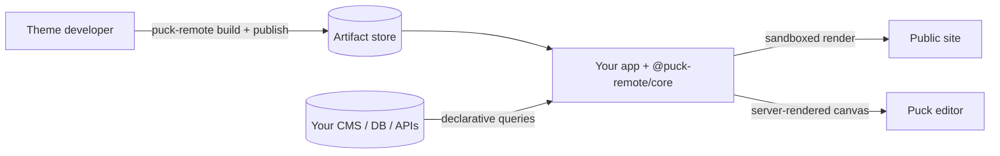

**puck-remote** is a self-hosted library that connects the [Puck](https://puckeditor.com) visual
editor to **themes written by other people**. Theme developers write React blocks; you host the
editor and the public site; editors compose pages. Theme code is treated as untrusted, so it only
ever runs inside a V8 isolate, inside a locked-down worker process.

## Why puck-remote

- **Untrusted themes, safely.** Blocks render in `isolated-vm` inside permission-restricted
  worker processes. No filesystem, network, secrets or timers reach theme code.
- **Data without trust.** Blocks *describe* their queries as JSON. Your server validates, dedupes,
  budgets, caches and runs them against the data source you plug in.
- **Real Puck.** The editor and the server-rendered site are standard Puck, built from the
  theme's JSON metadata. Slots, nested blocks and drag-and-drop work as usual.
- **Hot theme updates.** Publish a new version and the host verifies and swaps it without a
  rebuild or restart. Rollback is one command.
- **Framework-agnostic, adapters everywhere.** The engine works on standard `Request` and
  `Response`; storage, cache, auth and data are adapters. Next.js bindings are included.

## Packages

<Cards>
  <Card title="Framework" href="/docs/installation">
    Install puck-remote in a Next.js app and render your first page.
  </Card>
  <Card title="@puck-remote/core" href="/docs/core">
    The engine: configuration, rendering, editor, HTTP handlers and adapters.
  </Card>
  <Card title="@puck-remote/cli" href="/docs/cli">
    Build a theme into a versioned artifact, publish it, roll back.
  </Card>
  <Card title="@puck-remote/sdk" href="/docs/sdk">
    `defineBlock`, fields, queries and the contracts for host plugins.
  </Card>
</Cards>

## Next steps

<Cards>
  <Card title="Installation" href="/docs/installation" />
  <Card title="Quick start (example monorepo)" href="/docs/quick-start" />
  <Card title="Trust model" href="/docs/concepts/trust-model" />
  <Card title="Build a theme" href="/docs/guides/theme-development" />
</Cards>
