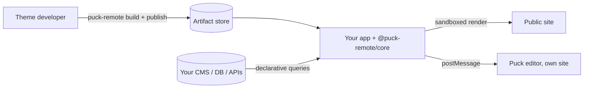

**puck-remote** is a self-hosted library that connects the [Puck](https://puckeditor.com) visual
editor to **themes written by other people**. Theme developers write React blocks; you host the
editor and the public site; editors compose pages. Theme code is treated as untrusted, so it only
ever runs inside a V8 isolate, inside a locked-down worker process.

## Why puck-remote

- **Untrusted themes, safely.** Blocks render in `isolated-vm` inside permission-restricted
  worker processes. No filesystem, network, secrets or timers reach theme code.
- **Data without trust.** Blocks *describe* their queries as JSON. Your server validates, dedupes,
  budgets and runs them against the data source you plug in.
- **Real Puck.** The editor is the full Puck editor with the theme's real components, in an
  iframe on its own credential-free site; the public site is server-rendered Puck. Slots, nested
  blocks and drag-and-drop work as usual.
- **Themes like Shopify's.** Pages ship inside the theme, so code and content are versioned
  together: no content migrations. Publish and the host verifies and swaps it without a rebuild or
  restart. Rollback is one command.
- **Small core.** The engine loads remote components and renders them. Auth, publishing
  workflows and storage belong to your app and its plugins. Next.js bindings are included.

## Packages

<Cards>
  <Card title="Framework" href="/docs/installation">
    Install puck-remote in a Next.js app and render your first page.
  </Card>
  <Card title="@puck-remote/core" href="/docs/core">
    The engine: configuration, rendering, pages in artifacts, editor payload and adapters.
  </Card>
  <Card title="@puck-remote/cli" href="/docs/cli">
    Build a theme (code and pages) into an artifact, publish it, pull editor changes, roll back.
  </Card>
  <Card title="@puck-remote/sdk" href="/docs/sdk">
    `defineBlock`, fields, queries and the contracts for host plugins.
  </Card>
  <Card title="@puck-remote/editor" href="/docs/concepts/editor">
    The editor: `<PuckEditorFrame>` (your admin page's Puck: data, history, fields) and `<PuckRemoteEditor>` (the canvas frame), and the protocol between them.
  </Card>
</Cards>

## Next steps

<Cards>
  <Card title="Installation" href="/docs/installation" />
  <Card title="Quick start (example monorepo)" href="/docs/quick-start" />
  <Card title="Trust model" href="/docs/concepts/trust-model" />
  <Card title="Build a theme" href="/docs/guides/theme-development" />
</Cards>
