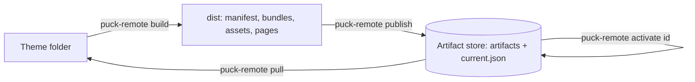

Theme developers use the CLI; the host never builds theme code. `build` turns a theme folder
(blocks and pages) into an artifact; `publish` stores it and makes it current; `pull` brings pages
edited in the editor back into the theme; `activate` moves the current artifact (rollback).

```npm
npm install -D @puck-remote/cli
```



```json title="package.json"
{
  "scripts": {
    "build": "puck-remote build",
    "release": "puck-remote build && puck-remote publish --artifacts ../my-app/artifacts",
    "pull": "puck-remote pull --artifacts ../my-app/artifacts"
  }
}
```

<Cards>
  <Card title="Commands" href="/docs/cli/commands" />
  <Card title="Build output" href="/docs/cli/build-output" />
  <Card title="Programmatic API" href="/docs/cli/programmatic-api" />
  <Card title="Build a theme" href="/docs/guides/theme-development" />
</Cards>
