`ArtifactLoader` holds the current `{ id, manifest, bundle, runtime }`. Ids are opaque strings
from the store; the loader only checks them against `[A-Za-z0-9._-]{1,128}` (`isArtifactId`) and
shows their first 12 characters in logs ([D-0189](/docs/internal/decisions#D-0189)).

## `loadArtifact(id)`

1. Read `manifest.json` from the store; decode as strict UTF-8 and parse JSON.
2. Validate with the host's zod schema (`manifestSchema`).
3. Recompute `propRefs` and `usesRequestParams` from the specs (never trust the CLI).
4. For **every** file listed (code, assets and pages): read it, compare its sha256 to the
   manifest; keep `bundle.js`.

Any error → `ArtifactError`.

## `reload({ force? })`

```mermaid
stateDiagram-v2
  [*] --> Serving
  Serving --> Checking: pointer changed
  Checking --> Validating: new artifact
  Checking --> Serving: same artifact
  Validating --> Swapping: manifest + hashes OK
  Validating --> Serving: rejected (keep last good)
  Swapping --> Serving: new runtime; old disposed after 30 s
```

Serialized (concurrent calls queue). Reads the pointer; if unchanged, nothing happens. Otherwise
it validates the artifact, creates a runtime through the renderer factory, swaps it in, and disposes
the previous runtime after **30 s** (`disposeGraceMs`) so in-flight requests finish. **It never
throws**: on failure it logs `REJECTED artifact update, still serving <id>` and keeps the last
good artifact.

## `watch(pollMs)`

Uses the store's `watch` change feed when present (fs: a directory watcher), otherwise polls
`readPointer` every `artifactPollMs` ([D-0197](/docs/internal/decisions#D-0197), [D-0065](/docs/internal/decisions#D-0065)).
Timers are `unref`'d.

## The host

`createHost(config)` wires the loader with `renderer({ id, bundle, limits: config.isolate })` and
creates the data and HTTP sources.
The renderer is chosen here, not in `config.ts`, so the config entry never imports isolated-vm.

## Theme file URLs

`handleTheme` resolves `<routes.theme>/<path>?v=<v>` with `ThemeFiles` (`static-files.ts`):

1. It reads the pointer. If the current artifact's `files[path]` starts with `v`, it serves that
   file, `immutable`.
2. Otherwise it looks up a per-process `path + v → artifact id` index. The index is built lazily
   from `artifacts.list()` and each manifest; manifests are cached forever, since artifacts are
   immutable. On a miss the index is refreshed, at most once every 10 s, and right away after the
   pointer changes ([D-0266](/docs/internal/decisions#D-0266)). Random `v`s therefore can't force
   repeated store scans.
3. Otherwise, or without `v`, it serves the current artifact's file with `no-cache` and an `etag`
   ([D-0267](/docs/internal/decisions#D-0267)).

Bytes are always checked against the manifest's full sha256. URLs are built by `themeFileUrl` and
`assetVersions` (`shared/urls.ts`). The host passes `assetVersions` in the isolate's ctx input, so
`ctx.assetUrl` appends `?v=`; the editor computes the same map from `manifest.files`
([D-0268](/docs/internal/decisions#D-0268)). Themes built with an older SDK ignore `assetVersions`,
so their asset URLs have no `v` and are served as the current file.

<Source path="packages/core/src/server/static-files.ts" />
<Source path="packages/core/src/shared/urls.ts" />
<Source path="packages/core/src/server/artifact-loader.ts" />
<Source path="packages/core/src/server/host.ts" />
<Source path="packages/artifacts-fs/src/index.ts" />
<Source path="packages/core/test/artifacts.test.ts" />
