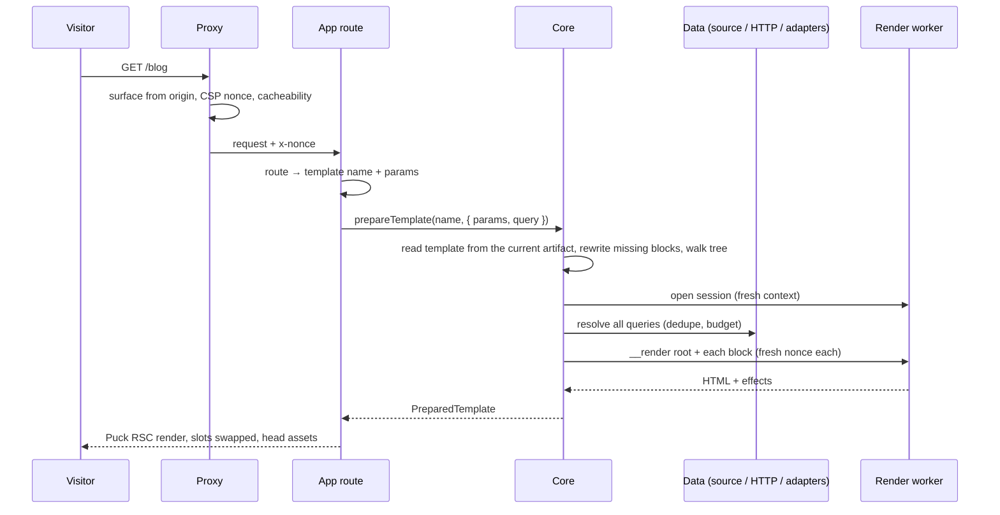

1. **Proxy** (`createProxy`): the `admin` surface on admin origins, `site` elsewhere; generate a
   CSP nonce; set security headers; when the app maps the path to a template (`options.template`), compute
   cacheability from the current artifact's manifest and template (no isolate: it only decides a
   header).
2. **The app's route** picks the template and its params (the example app maps the path to the
   template of the same name) and calls `remote.loadTemplate(name, { params, searchParams })`:
   search params are reduced to first values, and `prepareTemplate` is memoized per request with
   React `cache()` (keyed by name, sorted params, query and locale), so the app's
   `generateMetadata` (built from the template's root props) and the page share **one isolate
   pass**.
   On an admin origin it answers 404 first: theme scripts never run next to the admin session.
3. **`core.prepareTemplate`** lazily starts the host (first artifact load, watcher). Params are checked (at most 32 string
   values of up to 1 KB, else `TemplateError`), and shadowed app root fields are warned about once
   per artifact.
4. **`prepareTemplate` pipeline** ([D-0018](/docs/internal/decisions#D-0018)):
   1. `readTemplate`: `templates/<name>.json` of the **current artifact**, hash-checked against
      `manifest.files` and validated with zod (no such template → 404); `stripResolved` removes any
      stray `__data`;
   2. `rewriteMissing`: unknown block types become `__missing` ([missing blocks](/docs/internal/architecture/missing-blocks));
   3. `collectInstances`: the host's own depth-first walk of root → content → slots
      ([D-0016](/docs/internal/decisions#D-0016)), giving every instance with its manifest metadata;
   4. **one render session** (a fresh isolate context) serves the whole request;
   5. `resolvePageData` in `public` mode: plan, dedupe, budget, execute
      ([query resolver](/docs/internal/architecture/query-resolver)). `$query` params are only passed if the
      template has a block that uses them; `$params` and `$template` refs read the app's params
      and the template name;
   6. render the root and every block in tree order with a **fresh nonce per call** (`ctx.template`,
      `ctx.params`); if the
      isolate died (memory or watchdog), later blocks get a new session;
   7. `mergeEffects`: dedupe styles/scripts and drop URLs that are not own assets or
      allowlisted https origins;
   8. release the session.
5. **`<PuckRemoteTemplate>`** renders theme stylesheets (`<link precedence="theme">`, hoisted by
   React 19), then Puck's RSC `<Render>` with `metadata.rendered`, then theme scripts with the
   nonce.
6. **Puck components** built by `buildRscConfig(manifest)` (cached per manifest) are synchronous:
   they look up the pre-rendered HTML by instance id and call `htmlToReact` to swap slots. A failed
   block renders `
`.

## Why pre-render instead of rendering inside Puck

Puck renders components synchronously, but the isolate call is asynchronous (it must be, so the
watchdog can fire, [D-0020](/docs/internal/decisions#D-0020)). Pre-rendering also lets the host know all stylesheet and
script effects before streaming markup, and keeps "one fresh context per request".

<Source path="packages/next/src/index.ts" />
<Source path="packages/core/src/server/public-render.ts" />
<Source path="packages/core/src/server/page-tree.ts" />
<Source path="packages/core/src/server/puck-rsc.tsx" />
<Source path="packages/core/src/react/PuckRemoteTemplate.tsx" />
<Source path="packages/core/src/server/templates.ts" />
<Source path="packages/core/src/server/root.ts" />
