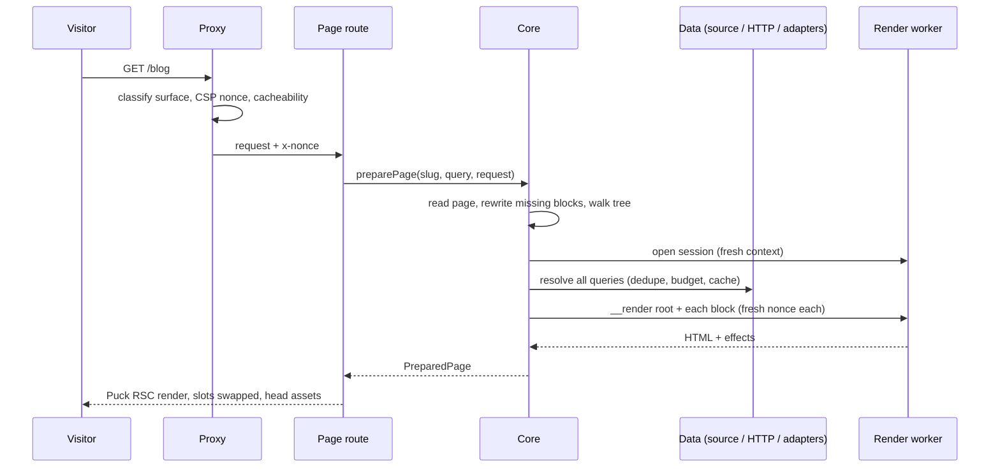

1. **Proxy** (`createProxy`): classify the surface; 404 if the origin doesn't serve the site;
   generate a CSP nonce; set security headers; compute cacheability from the page and the active
   manifest (no isolate, no hash verification: it only decides a header).
2. **Page route** calls `remote.loadPage(props)`: the slug is normalized
   (`a-z0-9-` segments, up to 5 levels, empty → `home`), search params reduced to first values,
   and `preparePage` is memoized per request with React `cache()`, so `generateMetadata` and the
   page share **one isolate pass**.
3. **`core.preparePage`**: rejects a non-site origin (returns `null` → 404), then lazily starts the
   host (first artifact load, watcher).
4. **`preparePage` pipeline** ([D-0018](/docs/internal/decisions#D-0018)):
   1. `readPage` from the `PageStore`, validated with zod; `stripResolved` removes any stray
      `__data`;
   2. `rewriteMissing`: unknown block types become `__missing` ([missing blocks](/docs/internal/architecture/missing-blocks));
   3. `collectInstances`: the host's own depth-first walk of root → content → slots
      ([D-0016](/docs/internal/decisions#D-0016)), giving every instance with its manifest metadata;
   4. open **one render session** (a fresh isolate context) for the whole request;
   5. `resolvePageData` in `public` mode: plan, dedupe, budget, execute, cache
      ([query resolver](/docs/internal/architecture/query-resolver)). `$query` params are only passed if the
      page has a block that uses them;
   6. render the root and every block in tree order with a **fresh nonce per call**; if the
      isolate died (memory or watchdog), later blocks get a new session;
   7. `mergeEffects`: dedupe title/meta/styles/scripts and drop URLs that are not own assets or
      allowlisted https origins;
   8. release the session.
5. **`<PuckRemotePage>`** renders theme stylesheets (`<link precedence="theme">`, hoisted by
   React 19), then Puck's RSC `<Render>` with `metadata.rendered`, then theme scripts with the
   nonce.
6. **Puck components** built by `buildRscConfig(manifest)` (cached per manifest) are synchronous:
   they look up the pre-rendered HTML by instance id and call `htmlToReact` to swap slots. A failed
   block renders `
`.

## Why pre-render instead of rendering inside Puck

Puck renders components synchronously, but the isolate call is asynchronous (it must be, so the
watchdog can fire, [D-0020](/docs/internal/decisions#D-0020)). Pre-rendering also lets the host know all `<head>`
effects before streaming markup, and keeps "one fresh context per request".

<Source path="packages/next/src/index.ts" />
<Source path="packages/core/src/server/public-render.ts" />
<Source path="packages/core/src/server/page-tree.ts" />
<Source path="packages/core/src/server/puck-rsc.tsx" />
<Source path="packages/core/src/react/PuckRemotePage.tsx" />
