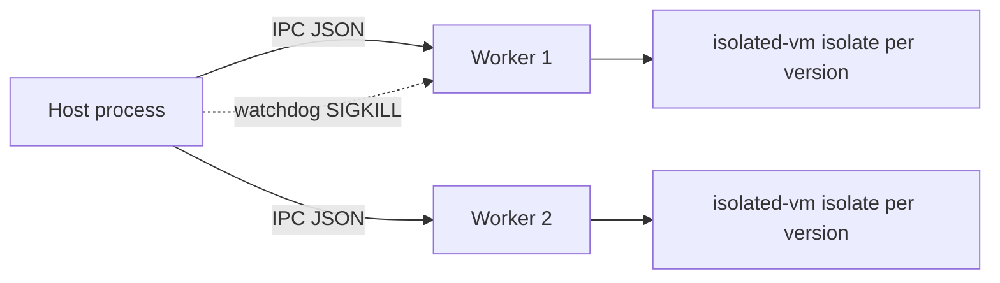

`workerPoolRenderer()` is the default ([D-0077](/docs/internal/decisions#D-0077)). It forks
`dist/render-worker.js`, which wraps an `IsolateRunner` and speaks the
[IPC protocol](/docs/internal/architecture/worker-protocol).



## How workers are started (`workerLaunchOptions`)

```
node --no-node-snapshot --permission --allow-addons
     --allow-fs-read=<allowlist…> --disable-warning=SecurityWarning
     --max-old-space-size=<maxOldSpaceMb, default 256>
     dist/render-worker.js
env: {}   (empty: no secrets, no config)
```

- `--permission` denies, by default, file writes, network, child processes and worker threads.
  Network denial needs Node 26 (Node 24's permission model doesn't cover it), hence the Node 26
  requirement ([D-0402](/docs/internal/decisions#D-0402)).
- `--allow-addons` is needed to load isolated-vm (a native addon). **Native code is not checked
  by Node's permission model**; this is the main residual risk.
- The **fs read allowlist** ([D-0087](/docs/internal/decisions#D-0087)) is computed by walking module resolution
  from the worker to isolated-vm and `node-gyp-build`: the worker's own `dist` directory, each
  `node_modules` directory on the lookup path, and the real paths of both packages. Both the
  symlinked and real spelling of every path are included, because the permission model checks
  real paths (pnpm symlinks; macOS `/var` → `/private/var`). On Linux the allowlist also holds
  `/etc/alpine-release`, which `node-gyp-build` stats while loading isolated-vm (its Alpine/musl
  check); one non-secret path, allowed whether or not it exists ([D-0400](/docs/internal/decisions#D-0400)).

## Scheduling

- `size`: at most `min(4, CPUs)` workers, spawned on demand.
- A session goes to an idle worker, else a new one while under `size`, else the least busy one.
- **Recycling**: a worker that served `maxCallsPerWorker` calls (default 5000) is retired once
  idle (bounds leaks and heap growth).
- If the chosen worker dies while a session opens, it retries once on a fresh worker.

## Failure handling

| Failure | Handling |
|---|---|
| Theme timeout / OOM | Inside the worker: the isolate's timeout, watchdog and recreation |
| Worker unresponsive | Host watchdog after `2 × watchdogMs + 500` ms: SIGKILL, call returns `timeout`; the worker counts as dead at once, so no new session picks it before it exits ([D-0401](/docs/internal/decisions#D-0401)) |
| Worker crash | Pending calls fail as `disposed`; the next session uses a fresh worker |
| Runtime replaced (new artifact) | `dispose()` SIGKILLs all workers after the loader's grace period |

Worker stdout/stderr lines are forwarded to the host log with the PID.

## Options

| Option | Default |
|---|---|
| `size` | `min(4, availableParallelism)` |
| `maxCallsPerWorker` | `5000` |
| `maxOldSpaceMb` | `256` |
| `wrap(command, args)` | none; `bubblewrap()` is the Linux preset ([D-0078](/docs/internal/decisions#D-0078)) |
| `log` | `console` |
| `tap(direction, message)` | none; observes every IPC message ([D-0086](/docs/internal/decisions#D-0086)) |

`bubblewrap()` runs each worker with `--unshare-all --die-with-parent --new-session`, a read-only
bind of `/`, a private `/tmp`, `/dev` and `/proc`.

## Why processes and not threads

A crash, OOM or hang only kills a worker, never the host, and Node's permission model applies per
process. A V8-level escape from the isolate lands in a process with no secrets, no network and
almost no filesystem.

<Source path="packages/core/src/server/runtime/worker-pool.ts" />
<Source path="packages/core/src/server/runtime/render-worker.ts" />
<Source path="packages/core/test/worker.test.ts" />
